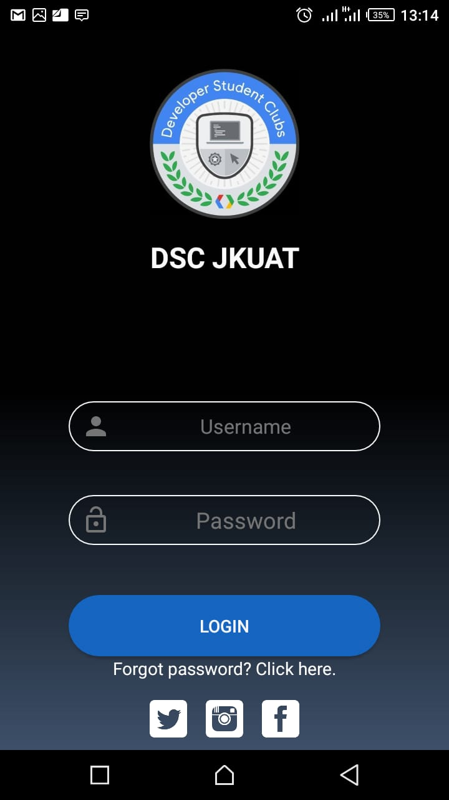

# LoginUI-design
A simple UI design  presentation in DSC Android JKUAT

STEPS:
1. Create Vertical Linearlayout
2. Add Image View
3. Add 2 Textviews
4. Add a button
5. Another Text View
6. A horizontal linear layout
7. NEW- Add scroll layout
8. Lets style our Views lets make it look AWESOME

